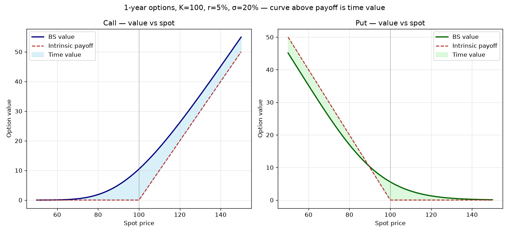
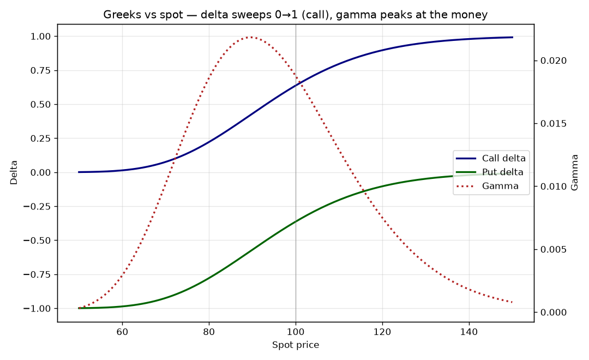
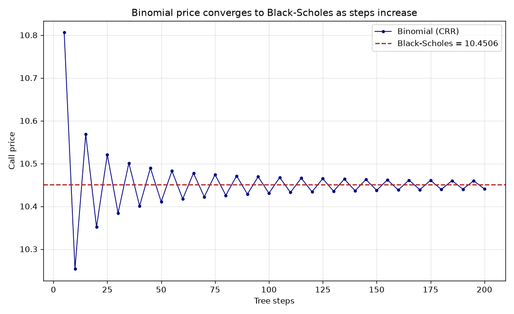

# Option Pricing Engine (OPE)

[](https://github.com/HoGSwain/option-pricing-engine/actions/workflows/ci.yml)

**AIFEL Project 6 — AI-Augmented Financial Engineering Laboratory**

Vanilla option pricing by **three independent methods** — **Black-Scholes**
(closed form), a **Cox-Ross-Rubinstein binomial tree** (European *and* American),
and a seeded **Monte-Carlo** engine — with the **full Greeks** (delta, gamma,
vega, theta, rho), **implied volatility**, and a plain-language explanation of
every result.

**Composed, not standalone.** An option is written *on an equity*, so pricing one
on a real ticker genuinely needs that equity's spot and volatility. OPE sources
the **spot from Project 1 (`fmde`)** and a **realized-volatility estimate from
Project 2 (`pae`)** — the true equity→option link — while the pure option math
still runs offline from explicit inputs. (Knowing when to compose and when to
stay standalone — as Project 5 does — is itself an engineering decision.)



---

## 1. Problem

What is an option worth, and how does that value move? Price is the discounted
risk-neutral expectation of the payoff — but the useful questions are the
sensitivities (the **Greeks**): how the value responds to the underlying
(delta/gamma), to volatility (vega), to time (theta), and to rates (rho). These
are easy to get subtly wrong: the `d₁`/`d₂` algebra, the risk-neutral tree
probability, the dividend term, or — most notoriously — **theta's sign**
(`∂V/∂t = −∂V/∂T`).

## 2. Why It Matters

Option prices and Greeks are how desks quote, hedge, and risk-manage
derivatives; a delta that's off feeds a wrong hedge, a theta with the wrong sign
misstates carry, and a single closed-form slip mis-marks a book. OPE implements
each number three independent ways, cross-checks them against each other, and
validates every pricer and Greek against a **textbook value, a closed-form
invariant, or a finite-difference oracle** — then ships each result with its
meaning and its limitations.

## 3. Solution

### Methodology
Given an option — and either explicit `spot`/`vol` or a `ticker` to source them —
the pipeline (full detail in [`docs/architecture.md`](docs/architecture.md)):

1. **Price** — `ope.option.black_scholes` (closed form), `ope.option.binomial`
   (CRR tree, European + American), `ope.option.monte_carlo` (seeded simulation
   with a standard error).
2. **Greeks & IV** — the five analytic Greeks, plus `implied_volatility` via
   `scipy.brentq`.
3. **Explain** — the option decision narrative + limitations (see §6).
4. **Storage & Reporting** — an analysis CSV + JSON metadata and a Markdown report.

### Key formulas
- **Black-Scholes** `Call = S e^(−qT)N(d₁) − K e^(−rT)N(d₂)`
- **Put-call parity** `C − P = S e^(−qT) − K e^(−rT)`
- **Binomial (CRR)** `u = e^(σ√dt)`, `d = 1/u`, `p = (e^((r−q)dt) − d)/(u − d)`;
  American nodes take `max(continuation, intrinsic)`
- **Monte-Carlo** `Sₜ = S·exp((r − q − ½σ²)T + σ√T·Z)`, discounted mean payoff ± `stderr`

Every formula is in [`docs/methodology.md`](docs/methodology.md).

### Validation
- **39 automated tests** (`pytest`) validating every method and Greek against a
  textbook value or an independent oracle — BS **call 10.4506 / put 5.5735**,
  **put-call parity** to `1e-10`, a **finite-difference Greeks oracle** (including
  theta's sign), **binomial→BS** convergence, **Monte-Carlo within 3 standard
  errors**, and **American-exercise invariants** (American put ≥ European put;
  American call = European call without dividends).
- Example (`ope price 100 1 --spot 100 --vol 0.2`, the Hull reference option):

  | Method | Price | | Greek | Value |
  |---|---|---|---|---|
  | Black-Scholes | $10.4506 | | Delta | +0.6368 |
  | Binomial (500) | $10.4466 | | Gamma | 0.01876 |
  | Monte-Carlo | $10.4205 ± 0.0468 | | Vega | +0.375 / 1% |
  | | | | Theta | −0.0176 / day |

  (Three methods agree to the cent. See [`reports/option_report.md`](reports/option_report.md).)

## 4. Reproducibility

### Installation
```bash
git clone https://github.com/HoGSwain/option-pricing-engine.git
cd option-pricing-engine
pip install -e ".[dev]"      # pulls pinned fmde + pae for the ticker path
```

### Running it
```bash
ope price 100 1 --spot 100 --vol 0.2                 # explicit inputs (Hull reference)
ope price 250 0.5 --ticker AAPL --source synthetic   # spot + realized vol from Projects 1-2
ope price 100 1 --spot 90 --vol 0.3 --kind put --exercise american   # early-exercise premium
ope price 100 1 --spot 100 --vol 0.2 --dividend 0.02
ope info
```

Or from Python:
```python
from ope.pipeline import run_option_analysis
r = run_option_analysis(strike=100, maturity=1, spot=100, volatility=0.20)
print(r.bs_price, r.greeks, r.methods_agree)
print(r.explanation.to_markdown())
```

### Charts & sample data
[`notebooks/generate_charts.py`](notebooks/generate_charts.py) regenerates the
value-vs-spot, Greeks, and binomial-convergence charts and `data/sample/`
entirely offline.

### Tests
```bash
pytest -v --cov=ope
```

### Screenshots
| | |
|---|---|
|  |  |
|  | |

## 5. Design Decisions

Every significant choice — the genuine (pinned) fmde/pae composition vs Project
5's standalone stance, raw partials in / conventional units out, the Black-Scholes
world, continuous dividend yield, European Greeks for American options, CRR
parameterization, MC path/seed defaults, and the `brentq` brackets — is documented
with full reasoning in **[`docs/assumptions.md`](docs/assumptions.md)**.

## 6. Explainability

Every run emits a deterministic, plain-language **explanation** — the sixth AIFEL
question. `ope.explain.explain()` produces exactly the interpretation a human
needs: *"…a 1-year at-the-money call worth $10.45… delta +0.637: the value moves
about $0.64 per $1 move in the underlying… vega $0.375 per 1% of volatility…
three independent methods agree — a cross-check that the price is right."* — plus
an explicit limitations list, most importantly that a **ticker-sourced volatility
is realized, not implied**, so it differs from a traded quote. It is exposed on
`OptionResult.explanation`, appended to every report, and generated from the
actual numbers — never by a language model. Full detail plus the explainability &
governance checklist is in **[`docs/explainability.md`](docs/explainability.md)**.

---

## Repository Structure
```
option-pricing-engine/
├── README.md, LICENSE, pyproject.toml, requirements.txt, CHANGELOG.md, CONTRIBUTING.md
├── data/{raw, cleaned, processed, sample, metadata}/
├── docs/{architecture, methodology, validation, assumptions, explainability, api, references}.md
├── src/ope/{option, source, storage, reporting, utils}/ + explain.py, pipeline.py, main.py
├── tests/                  # 39 passing pytest tests
├── notebooks/              # reproducible chart-generation script
├── reports/                # generated Markdown option report
├── screenshots/            # value-vs-spot, Greeks, binomial-convergence charts
└── app/                    # reserved for a future lightweight UI
```

## Future Improvements
- A volatility smile / implied-vol surface (Black-Scholes assumes constant σ).
- Discrete cash dividends on ex-dates (vs a continuous yield).
- American Monte-Carlo (Longstaff-Schwartz) to complement the tree.
- Jump-diffusion / stochastic volatility (Merton, Heston) for fat tails.
- A minimal Streamlit app in `app/` for interactive option exploration.

## License
MIT — see [`LICENSE`](LICENSE).

---

*This is Project 6 of the AI-Augmented Financial Engineering Laboratory (AIFEL)
portfolio — the derivatives primitive. It composes with the equity projects: the
spot from Project 1 (`fmde`) and the realized volatility from Project 2 (`pae`).*
